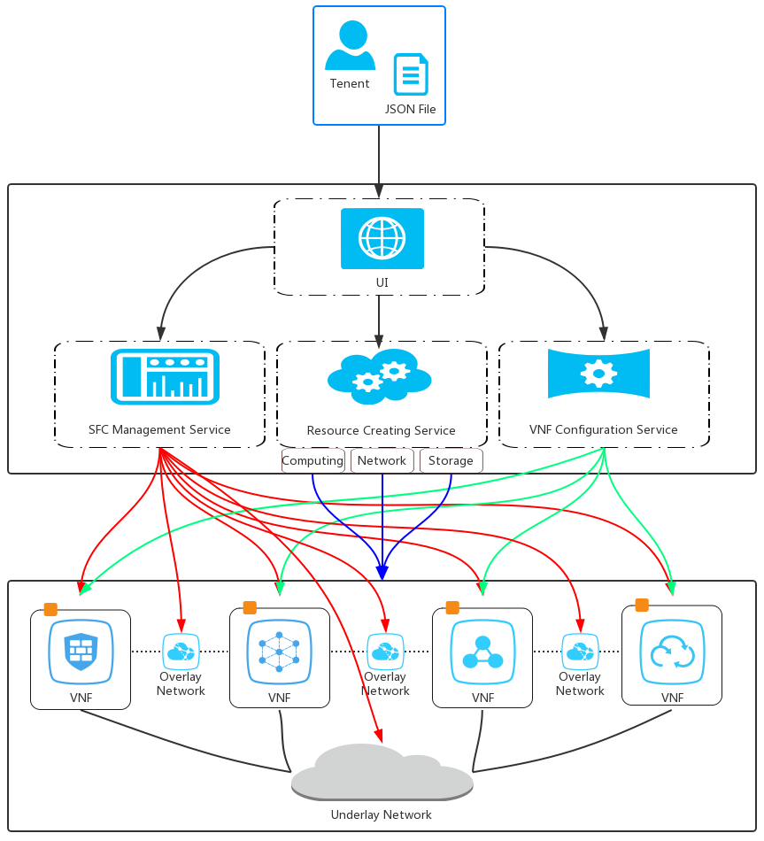

## Overview

The sfctestbed is a OpenStack based sfc testbed platform, developed by vnetlab team in dlut. You can deploy the sfctestbed on a OpenStack cluster with nodes connected by a simple commodity L2 switch and L3 router. On the platform, each user can define multiple service function chaining instances, each of which consists of a series of virtualized network functions and internal overlay links. You can manipulate the lifecyle orchestration of the service function chaining by GUI operation.

## Features

1. create the custom service function chaining instance by GUI operation. 
2. config the virtual network functions and overlay links of the service function chaining instance.

## Catalog

1. sfctestbed_deployable: providing compiled deployable version.
2. sfctestbed_source: providing version of source code, can be re compiled.
